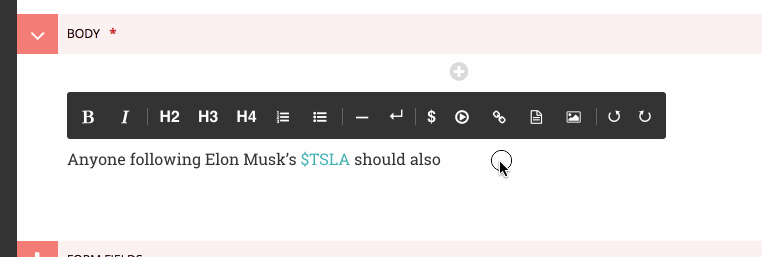

# 对Draftail编辑器进行扩展

Wagtail的富文本编辑器是利用 [Draftail](https://www.draftail.org/) 构建的，同时其功能可通过插件加以扩展。

插件有三种类型：

+ 内联样式 -- 用于对行的一部分进行格式化，比如`bold`、`italic`、`monospace`
+ 块 -- 用于表示内容的结构，比如`blockquote`、`ol`
+ 实体 -- 用于输入一些附加数据/元数据，比如`link`（带有URL）、`image`（带有文件）

所有这些插件，都是在一个类似基线上创建出来的，下面就以一个最简单的示例 -- 一个用于内联样式`mark`的定制功能 --来演示插件的创建。将下面的代码放入任意已安装应用中的`wagtail_hooks.py`中：

```python
import wagtail.admin.rich_text.editors.draftail.features as draftail_features
from wagtail.admin.rich_text.converters.html_to_constentstate import InlineStyleElementHandler
from wagtail.core import hooks

# 1. 使用 register_rich_text_features 钩子
@hooks.register('register_rich_text_features')
def register_makr_feature(features):
    """
    对`mark`功能进行注册，该功能使用了 Draft.js 的 `MAKR` 内联样式类型
    并是作为HTML的 `<mark>` 标签进行存储的
    """

    feature_name = 'mark'
    type_ = 'MARK'
    tag = 'mark'

    # 2. 就Draftail如何在其工具栏中处理该功能，而对其进行配置
    control = {
        'type': type_,
        'label': '☆',
        'description': 'Mark',
        # 下面的这个属性实际上并不需要 -- Draftail已经有着预定义MARK样式
        # 'style': {'textDecoration': 'line-through'},
    }

    # 3. 调用 register_editor_plugin 来对 Draftail的这些配置进行注册
    features.register_editor_plugin(
        'draftail', feature_name, dratail_features.InlineStyleFeature(control)
    )

    # 4. 对从数据库到编辑器及反过来的内容装换进行配置
    db_conversion = {
        'from_database_format': {tag: InlineStyleElementHandler(type_)},
        'to_database_format': {'style_map': {type_: tag}},
    }

    # 5. 调用 register_converter_rule，来对内容转换进行注册
    features.register_converter_rule('contentstate', feature_name, db_conversion)

    # 6. （可选的）将该功能加入到默认功能清单，以令到其在那些没有指定
    # 显式“功能”清单的富文本字段上可用
    features.default_features.append('mark')
```

对于所有Draftail插件，这些步骤都是一样的。以下是一些要点：

+ 在各个地方，都要始终使用该功能的Draft.js类型或Wagtail的功能名称（Consistently use the feature's Draftail.js type or Wagtail feature names where approciate）。
+ 要给予到Draftail足够信息，其才知道如何产生出该功能的按钮，以及对其进行渲染的方式（有关这个问题后面会有更详尽的说明）。
+ 对转换方式加以配置，以使用正确的HTML元素（因为他们是存储在数据库中的）。

有关培训选项的详细信息，可前往 [Draftail文档](https://www.draftail.org/docs/formatting-options)，查看所有的细节。以下是一些有关控件的要点：

+ `type`是唯一强制要求的信息。
+ `icon`、`label`与`description`一起，用于在工具栏中显示该控件
+ 控件的`icon`可以是使用带有CSS类的某种图标字体的字符串，比如说`'icon': 'fas fa-user',`。也可以是使用SVG路径或SVG符号引用时的字符串数组，比如`'icon': ['M100 100 H 900 V 900 H 100 Z'],`。SVG的路径需要设置为一个 `1024x1024` 的视框。

## 新内联样式的创建

除了此前的示例外，内联样式还要取得一个`style`属性，用于定义何种CSS规则将应用到编辑器中的文本。一定要阅读一下 [Draftail文档](https://www.draftail.org/docs/formatting-options)中有关内联样式的内容。

最后，数据库的导入/导出转换，使用了一个`InlineStyleElementHandler`，将给定的标签（上面示例中的`mark`）映射到某种Draftail类型，而逆向的映射则是使用 `style_map`的[Draft.js的输出器配置](https://github.com/springload/draftjs_exporter)完成的。

## 建立新块

块与内联样式一样简单：

```python
from wagtail.admin.rich_text.converters.html_to_contentstate import BlockElementHandler

@hooks.register('register_rich_text_features')
def register_help_text_feature(features):
    """
    对 `help-text` 功能进行注册，该功能使用了 Draft.js 的 `help-text` 块类型，
    并是作为 `<div class="help-text">` 标签进行存储的。
    """

    feature_name = 'help-text'
    type_ = 'help-text'

    control = {
        'type': type_,
        'label': '?',
        'description': '帮助文本',
        # 可选的，这里可以告诉Draftail在编辑器中显示这些块时，使用何种元素
        'element': 'div',
    }

    features.register_editor_plugin(
        'draftail', feature_name, draftail_features.BlockFeature(control, css={'all': ['help-text.css']})
    )

    features.register_converter_rule('contentstate', feature_name, {
        'from_database_format': {'div.help-text': BlockElementHandler(type_)},
        'to_database_format': {'block_map': {type_: {'element': 'div', 'props': {'class': 'help-text'}}}},
    })
```

以下时主要的不同：

+ 这里可配置一个`element`，来告诉Draftail如何在编辑器中渲染这些块。
+ 这里使用的是`BlockFeature`来注册插件。
+ 这里使用了`BlockElementHandler`与`block_map`来设置转换。


作为可选项，也可使用CSS类`Draftail-block--help-text`（`Draftail-block--<block type>`），来定义块的样式。

就是这样了！其余的复杂性，就在于需要编写CSS来赋予编辑器中块的样式了。

<a name="creating-new-entities"></a>
## 新实体的创建

> __警告__ 这是一项高级特性。请再三考虑是否真的需要此特性。

实体就不再简单地是一些工具栏中的格式化按钮了。他们通常需要多得多的技能，需要与APIs进行通信或请求更多的用户输入（they(entities) usually need to be much more versatile, communicating to APIs or requesting further user input）。如此等等，

+ 有极大可能需要编写大量的JavaScript代码，其中一些还需要React（you will most likely need to wirte a __hefty dose of JavaScript__, some of it with React）。
+ API是非常底层的。因此有极大可能需要一些 Draft.js 的知识（the API is very __low-level__. You will most likely need some __Draftail.js knowledge__）。
+ 对富文本中的UIs进行定制非常艰难。要做好在不同浏览器中进行测试而花大量时间的准备（custom UIs in rich text can be brittle. Be ready to spend time __testing in multiple browsers__）。

好消息是有了这样的底层API后，就令到第三方Wagtail插件可以在富文本功能上进行创新，带来新的体验种类。但与此同时，请考虑经由 `StreamField` 特性来实现UI，因为对于Django开发者来说，他有着经历了实战考验的API。

以下为创建新实体特性的一些主要要求：

+ 与内联样式及块一样，要注册一个编辑器插件。
+ 编辑器插件必须注册一个`source`：一个负责在编辑器中创建新实体实例的、使用Draft.js API 的React组件。
+ 编辑器插件还需要一个`decorator`（用于内联实体）或`block`（用于块实体）：一个负责在编辑器中显示出实体实例的React组件。
+ 与内联样式与块类似，要设置好到数据库及从数据的转换。
+ 该转换占了更大比重，因为实体包含了需要被序列化为HTML的数据。

关于React组件的编写，Wagtail将其自带的React、Draft.js与Draftail的依赖，作为全局变量加以暴露。有关此方面的详细信息，请参阅 [对客户端组件进行扩展](amdin_templates.md#extending-clientside-components)。而更深入的讨论，则请移步 [Draftail文档](https://www.draftail.org/docs/formatting-options) 以及 [Draftail导出器文档](https://www.draftail.org/docs/formatting-options)。

下面是一个详细示例，用来演示这些工具在Wagtail环境下的使用方式。为此示例目的，这里可设想某份金融报刊的新闻团队的情形。他们打算撰写有关股票市场的报道，在他们内容的任意位置对特定股票进行引用（比如在某个句子中引用 "$TSLA"），随后他们的报道中将自动完善该股票的信息（链接、数字、迷你图表等）。

编辑器工具栏将包含一个显示了可选股票清单的“股票选择器”，最后将用户的选择作为一个文本式代币进行插入。比如下面将仅随机选取一支股票：



在发布时，这些代币将保存在富文本中。而在网站上该新闻报道被显示出来时，则将会把来自某个API的实时的市场数据，插入到各个代币旁边：


为了实现此特性，就要像内联样式与块那样，首先对此富文本特性进行注册：

```python
@hooks.register('register_rich_text_features')
def register_stock_feature(features):
    features.default_features.append('stock')

    """
    对该 `stock` 功能进行注册，这里使用了 `STOCK` 的 Draft.js 实体类型，同时
    是以一个 `<span data-stokc>`的标签，作为HTML进行存储的。
    """

    feature_name = 'stock'
    type_ = 'STOKC'

    control = {
        'type': type_,
        'lable': '$',
        'description': '股票',
    }

    features.register_editor_plugin(
        'draftail', feature_name, draftail_features.EntityFeature(
            control,
            js=['stock.js'],
            css={'all': ['stock.css']}
        )
    )

    features.register_converter_rule('contentstate', feature_name, {
        # 这里请注意，数据库转换要比内联样式及块更为复杂。
        'from_database_format': {'span[data-stock]': StockEntityElementHandler(type_)},
        'to_database_format': {'entity_decorators': {type_, stock_entity_decorator}},
    })
```

`EntityFeature`上的 `js` 与 `css` 关键字，可用于指定额外的、于此功能出于活动状态时进行加载的JS与CSS文件。二者都是可选的。他们的值被添加到一个`Media`对象，有关这些对象的更多文档，在 [Django表单资源文档](https://docs.djangoproject.com/en/stable/topics/forms/media/) 中可以找到。

因为实体保有数据，因此到数据库及从数据库的转换格式，就要更为复杂。这里就必须创建这两个转换处理器：

```python
from draftjs_exporter.dom import DOM
from wagtail.admin.rich_text.converters.html_to_contentstate import InlineEntityElementHandler

def stock_entity_decorator(props):
    """
    Draft.js 的 ContentState 格式到数据库的HTML。
    将 STOCK 实体，转换为一个 span 标签。
    """

    return DOM.create_elment('span', {
        'data-stock': props['stock'],
    }, props['children'])


class StockEntityElementHandler(InlineEntityElementHandler):
    """
    数据库的HTML到Draft.js的ContentState格式。
    将该 span 标签，以正确的数据，转换为一个 STOCK 实体。
    """

    mutability = 'IMMUTABLE'

    def get_attribute_data(self, attrs):
        """
        从 "data-stock" HTML属性取得 `'stock'` 的值。
        """

        return {
            'stock': attrs['data-stock'],
        }
```

注意这里他们是如何完成类似的转换，使用的却是不同的APIs. `to_database_format`是使用 [Draft.js 的导出器](https://github.com/springload/draftjs_exporter) 组件的 API 构建的，而 `from_database_format` 则使用了一个 Wagtail 的 API.

下一步就是将 JavaScript 进行添加，来定义出创建实体的方式（也就是 `source`）与其显示的方式（`decorator`）。在 `stock.js` 中，定义了数据源组件：

```javascript
const React = window.React;
const Modifier = window.DraftJS.Modifier;
const EditorState = window.DraftJS.EditorState;

const DEMO_STOCKS = ['AMD', 'AAPL', 'TWTR', 'TSLA', 'BTC'];

// 这并非一个真正的 React 组件 -- 在实体被渲染时，尽可能快地创建出实体。
class StockSorce extends React.Component {
    componentDidMount() {
        const { editorState, entityType, onComplete } = this.props;

        const content = editorState.getCurrentContent();
        const selection = editorState.getSelection();

        const randomStock = DEMO_STOCKS[Math.floor(Math.random() * DEMO_STOCKS.length)];

        // 使用 Draft.js 的API、以正确的数据来创建一个新的实体。
        const contentWithEntity = content.createEntity(entityType.type, 'IMMUTABLE', {
            stock: randomStock,
        });
        const entityKey = contentWithEntity.getLastCreatedEntityKey();

        // 这里还要添加一些将要激活的实体的一些文本。
        const text = `${randomStock}`;

        const newContent = Modifier.replaceText(content, selection, text, null, entityKey);
        const nextState = EditorState.push(editorState, newContent, 'insert-characters');

        onComplete(nextState);
    }

    render() {
        return null;
    }
}
```

此源数据组件，使用了由 [Draftail](https://www.draftail.org/docs/api) 所提供的数据与回调。其还使用了来自全局变量的依赖 -- 请参阅 [对客户端组件进行扩展](admin_templates.md#extending-clientside-components)。

随后创建出装饰器组件：

```javascript
const Stock = (props) => {
    const { entityKey, contentState } = props;
    const data = contentState.getEntity(entityKey).getData();

    return React.createElement('a', {
        role: 'button',
        onMouseUp: () => {
            window.open(`https://finance.yahoo.com/quote/${data.stock}`);
        },
    }, props.children);
};
```

这是一直白的 React 组件了。其并未使用 JSX, 因为这里不打算非得要为这些JavaScript代码而使用一个构建步骤。其使用了 ES6 的语法 -- 在Internet Explorer 11 中无法运行，除非使用一个构建步骤转换到 ES5 的语法。

最后将这些 JS组件注册到插件：

```javascript
window.draftail.registerPlugin({
    type: 'STOCK',
    source: StockSource,
    decorator: Stock,
});
```

就是这样了！该项设置的所有代码，将在站点前端上最终生成以下的HTML：

```html
<p>
    Anyone following Elon Mask's <span data-stock="TSLA">$TSLA</span> should also look into <span data-stock="BTC">$BTC</span>.
</p>
```

为了最终完成该示例，这里可将一点 JavaScript 代码加入到前端，从而给这些代币装饰上一些链接与迷你图表：

```javascript
[].slice.call(document.querySelectionAll('data-stock')).forEach((elt) => {
    const link = document.createElement('a');
    link.ref = `https://finance.yahoo.com/quote${elt.dataset.stock}`;
    link.innerHTML = `${elt.innerHTML}<svg width="50" height="20" stroke-width="2" stoke="blue" fill="rgba(0, 0, 255, .2)"><path d="M4 14.19 L 4 14.19 L 13.2 14.21 L 22.4 13.77 L 31.59 13.99 L 40.8 13.46 L 50 11.68 L 59.19 11.35 L 68.39 10.68 L 77.6 7.11 L 86.8 7.85 L 96 4" fill="none"></path><path d="M4 14.19 L 4 14.19 L 13.2 14.21 L 22.4 13.77 L 31.59 13.99 L 40.8 13.46 L 50 11.68 L 59.19 11.35 L 68.39 10.68 L 77.6 7.11 L 86.8 7.85 L 96 4 V 20 L 4 20 Z" stroke="none"></path></svg>`;
    
    elt.innerHTML = '';
    elt.appendChild(link);
});
```

也可以创建定制块（请参阅单独的 [Draftail 文档](https://www.draftail.org/docs/blocks)），但关于定制块的创建，这里不再赘述，因为在 Wagtail 中， [StreamField](https://wagtail.xfoss.com/topics/streamfield.html#streamfield) 是创建块级别富文本的最佳方式。

<a name="integration-of-the-draftail-widgets"></a>
## Draftail小部件的集成

为更进一步对 Draftail 小部件集成到UI的方式加以定制，有着以下的 CSS与JS的额外扩展点：

+ 在 JavaScript中，使用 `[data-draftail-input]` 属性选择器，来选定带有数据的输入，并使用对封装了编辑器的元素，使用 `[data-draftail-editor-wrapper]` 属性（in JavaScript, use the `[data-dratail-input]` attributes selector to target the input which contains the data, and `[data-dratail-editor-wrapper]` for the element which wraps the editor）。
+ 编辑器实例是绑定在某个必将访问的输入字段上的。使用`document.querySelector('[data-draftail-input]').draftailEditor`（the editor instance is bound on the input field for imperative access. Use `document.querySelector('[data-draftail-input]').draftailEditor`）。
+ 在 CSS中，使用以`Draftail-`作为前缀的类（in CSS, use the classes prefixed with `Draftail-`）。
