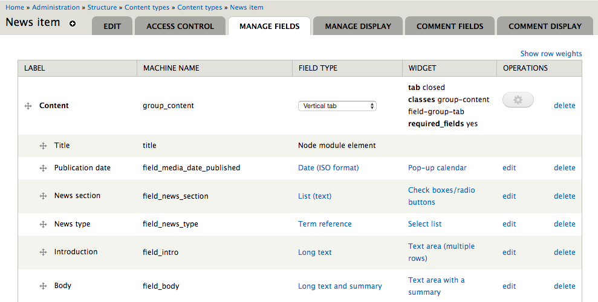

# Wagtail之道

**The Zen of Wagtail**

Wagtail诞生于多年的网站开发经验中，诞生于哪些方法好用、哪些方法不好用的试错中，试图在功能的强大与程序的简洁、结构化与灵活性之间找到平衡（Wagtail has been born out of many years of experience building websites, learning approches that work and ones that don't, and striking a balance between power and simplicity, structure and flexibility）。创造Wagtail的人们，希望大家能发现，Wagtail正是处于这一最佳点位。但是，他作为一套软件，Wagtail也只能做到这里了 -- 此时正是大家可以创建一个优美而又有趣的网站的时候。正由于此，尽管大家都在磨拳擦掌，跃跃欲试，还是要花点时间来了解一下Wagtail是何种设计原则来建立的。

本着“[Python之道](https://www.python.org/dev/peps/pep-0020/)”精神，Wagtail哲学也是一套既包含了使用Wagtail构建网站的，也包含了持续进行的Wagtail自身开发的指导原则。

## Wagtail并非一个开箱即用的网站

是不能通过将一些现成模块拼在一起就得到一个漂亮的站点的 -- 需要写代码。

## 要一直清楚自己所扮演的角色

**Always wear the right hat**

有效地使用Wagtail的关键，是要认识到在创建一个网站时，涉及到多个角色：内容作者、站点管理员、开发者与设计师。当然他们可能是不同的人，但也不必非得要是不同的人 -- 比如在使用Wagtail构建自己的个人博客是，就能发现你自己在这写不同角色之间变换。但无论哪种方式，都要注意在某时某刻你正在做什么，并要使用适当的功能来做那件事。

内容作者或站点管理员，会通过Wagtail的管理界面，来完成他们的工作；开发者或设计师则要花大量时间来编写Python、HTML或CSS代码。这实际上是个好事：Wagtail设计初衷不是要取代编程工作。或许未来的某一天，有人搞出来一种通过托放操作，就能建立出与经由代码编写而建立的同样强大的网站，但Wagtail绝不是那样的工具，Wagtail也不会尝试成为那样的工具。

一种常见的错误做法，就是将过多的权力与责任给予到内容作者与站点管理员 -- 实际上，当他们是你的客户时，这往往就是他们会吼你的原因。站点成功有赖于你敢于对此说不。内容管理的真正威力，不是来自将控制权交给内容管理系统的用户，而是来自设定好不同角色之间的边界。抛开其他的不说，这意味着不要让网站编辑在内容编辑界面去搞设计和布局，不要让站点管理员去构建那些可以通过代码来实现的复杂的交互流程。

## 内容管理系统应尽可能有效地、直接地让网站编辑头脑中的想法顺利表达出来，并存入到数据库

** A CMS should get information out of an editor's head and into a database, as efficiently and directly as possible**

不论网站是关于汽车、猫咪、甜点或房屋中介，内容作者都会带着他们想要发布在网站上的那些特定领域的信息，来到Wagtail的管理界面。因此作为网站建设者的目标，就是要将这些信息以他们原始的格式 -- 而不是依照某位特定作者认为信息应该怎样的想法，提炼并存储起来。

将设计方面的关注点，从页面内容分离出来，有着诸多好处。这样做确保设计在整个站点范围保持一致，而不会随着网站编辑们的朝令夕改而改变。这样做还可以实现对页面中的有用信息的充分利用 -- 比如在页面是关于活动组织时，那么就会有一个专门的“活动”页面，该页面带有活动日期与地点的数据字段，这些字段就允许以日历试图或过滤清单的方式来展示这些活动，这在仅通过在通用页面应用不同样式的标题，是做不到的。最后，如果在未来某个时期对站点进行了重新设计，或是将站点整个迁往了不同平台，这样做还可以确保站点内容将以其新的设置工作，而无需进行某种特定方式再进行格式化。

现在假设有某位内容作者过来提交一个请求：“我们要将这个文本设置为亮粉色的 Comic Sans字体”。你给他们的疑问可能是：“为什么啊？这点文本有什么特殊的地方吗” 如果他们的答复是“我只是喜欢那样子”，那么就必须委婉的劝导他们，设计方面的决定由不得他们（抱歉）。但如果他们的答复是“那个文本输入小朋友板块的”，此答复就给予了一种将编辑与设计的不同关注点分开的方法：要赋予网站编辑将某些页面指定为“小朋友板块”的能力（经由标签特性、不同页面模型，或者站点层次结构等方式），同时让设计师可以根据这种制定，来决定怎样应用各种样式。

## 程序员的最佳用户界面，往往就是某种编程语言

**The best user interface for a programmer is usually a programming language**

通常见到的内容管理系统，在定义构成页面的数据模型时，总是采用点击式界面（a point-and-click interface）。

在市场营销上这样做看起来很不错，但在现实中，绝不会有CMS的终端用户，能够切实地造成那种根本改变 -- 在某个线上站点，不会少 -- 除非他们有着程序员的那种对站点构建方式的洞察，以及知悉修改将带来何种影响（it looks nice in the sales pitch, but in reality, no CMS end-user can realistically make that kind of fundamental change -- on a live site, no less -- unless they have a programmer's insight into how the site is built, and what impact the change will have）。正是因为这样，那些涉及点击界面的事情，将总是需要程序员来完成 -- 所完成的所有工作，就是从舒适的代码编写世界，造出这些点击界面即可。在编写代码的世界里，有着整个的工具链生态，从文本编辑器到版本控制系统，可以帮助程序员进行代码修正的开发、测试与部署。

Wagtail发现，在没有充分理由的情况下，绝大部分编程任务，都需要通过编写代码才能最好的完成，而不是尝试将这些编程任务转化为那种装箱式的练习（Wagtail recognises that most programming tasks are best done by writing code, and does not try to turn them into box-filling exercises when there's no good reason to）。同样，在给站点构建功能时，应始终记住某些特性注定要由程序员，而非内容编辑来维护，还要考虑将这些特性做成经由管理界面可配置的做法，到底会带来更多的便利，还是更多的障碍。比如Wagtail就提供了一个用于允许内容编辑创建通用目的数据收集表单的表单构建器。你或许打算将其用于一些与（比如）客户关系管理系统或支付处理器等进行集成的更为复杂的表单的基础 -- 而在此情况下，除了对后端逻辑进行重写之外，就没有办法对表单字段进行编辑，因此通过Wagtail来将他们做成可编辑，是没什么价值的。对于这类需求，使用Django的表单框架来构建更好，因为Django的表单框架中的表单字段，完全是用代码进行定义的。
