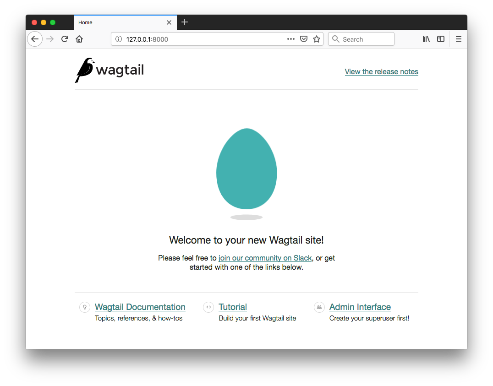
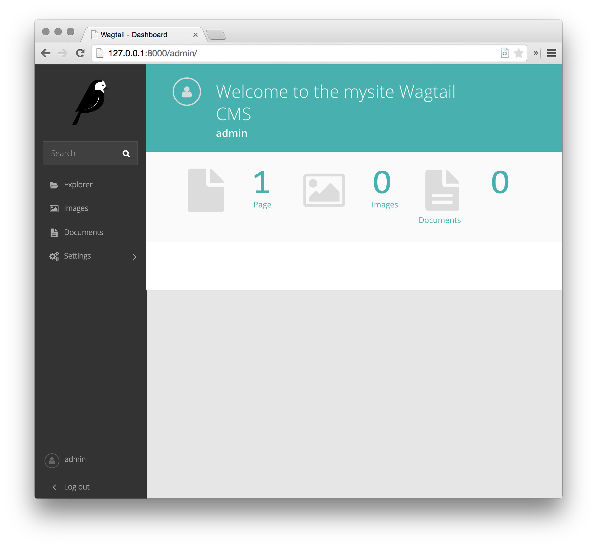
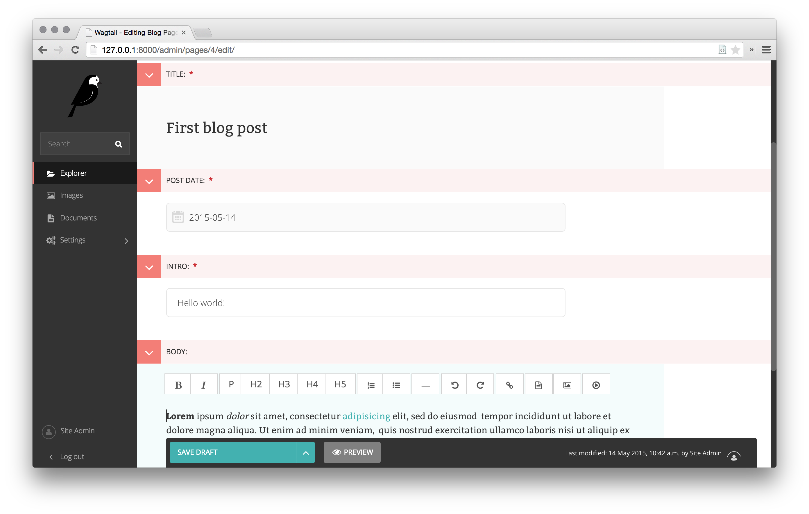
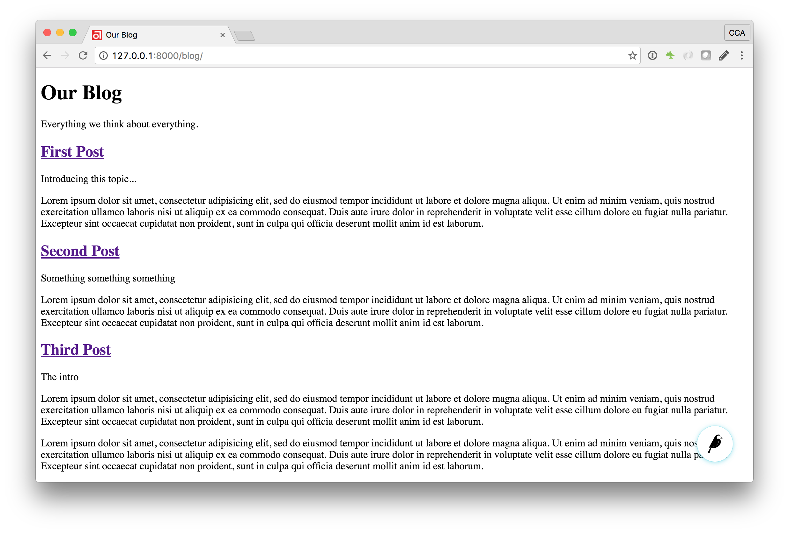
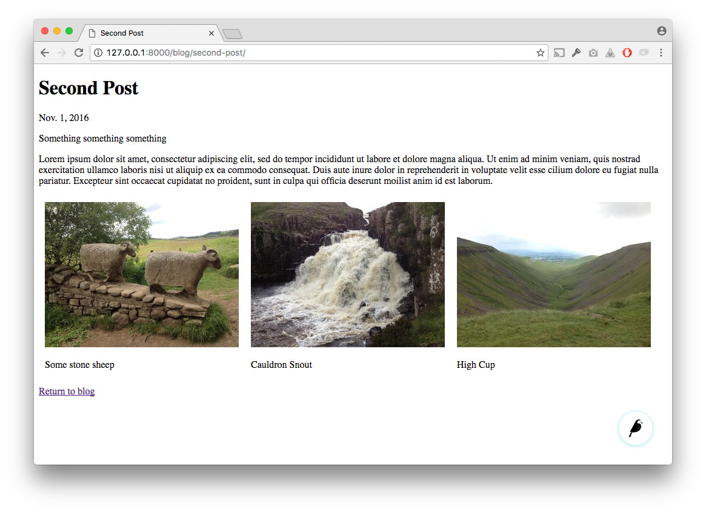

# 第一个Wagtail站点

> **注意** 此教程讲的是有关建立一个全新Wagtail项目的内容。如要将Wagtail加入到某个既有Django项目，请参考[将Wagtail集成到Django项目](integrating_into_django.md)。

1. 安装 Wagtail 与其依赖：

```sh
$ pip install wagtail
```

2. 开始你的站点：

```sh
$ wagtail start mysite
$ cd mysite
```

Wagtail提供了与`django-admin.py startproject` 类似的 `start` 命令。在项目中运行 `wagtail start mysite`将生成一个新的、有着几个特定于 Wagtail 的附加文件的 `mysite` 文件夹，这些文件包括了：

+ 所需的项目设置
+ 一个有着空白的 `HomePage` 模型的“主页”应用
+ 一些基础模板
+ 一个简单的“搜索”应用。

3. 安装项目依赖

```sh
$ pip install -r requirements.txt
```

此步骤确保刚创建的项目具有相关版本的Django

4. 创建数据库

```sh
$ ./manage.py migrate
```

在没有更新项目设置时，数据库将是项目目录中的一个 SQLite 数据库文件。

5. 创建出一个管理员用户

```sh
$ ./manage.py createsuperuser
```

6. 启动服务器

```sh
$ ./manage.py runserver
```

如没有什么错误的话，访问 [http://127.0.0.1:8000]() 就可以看到一个欢迎页面了：



可在 [http://127.0.0.1:8000/admin]() 处访问到管理区



## 对`HomePage`模块进行扩展

在此开箱即用的情况下，“主页”应用在`models.py`文件中，定义了一个空白的`HomePage`模型，以及与该空白模型一起的数据库迁移，由他们二者一起，创建出了一个主页，并将Wagtail配置为使用该主页。

按照下面这样对`home/models.py`进行编辑，将一个`body`字段加入到该模型中：

```python
from django.db import models

from wagtail.core.models import Page
from wagtail.core.fields import RichTextField
from wagtail.admin.edit_handlers import FieldPanel

class HomePage(Page):
    body = RichTextField(blank=True)

    content_panels = Page.content_panels + [
        FieldPanel('body', classname="full"),
    ]
```

`body` 被定义为 `RichTextField`，一种特殊的 Wagtail 字段。当然也可以使用任意的 [Django 核心字段](https://docs.djangoproject.com/en/stable/ref/models/fields/)。`content_panels` 定义了功能及编辑接口的布局（`content_panels` define the capatibilities and the layout of the editing interface）。请参考更多有关 [创建页面模型](topics/pages.md)。

此时运行 `./manage.py makemigrations`，接着 `./manage.py migrate` 命令，来用模型改变对数据库作出更新。在每次修改了模型定义时，都 **必须** 运行这两个命令。

现在就可以在 Wagtail 管理区（前往 “页面”、“主页”，然后点击“编辑”）对该主页进行编辑了。在`body`字段输入一些文字，并发布该页面。

现在就需要将对应的页面模板加以更新，以反映对模型作出的改变。Wagtail使用一般Django模块，来渲染各种页面类型。默认他将查找一个由应用与模型名称组成、以下划线表示大写字母分开的模板文件名（比如，“主页”应用中的`HomePage`模型，就成为了`home/home_page.html`）。该模板文件可存在于由 [Django的模板规则](https://docs.djangoproject.com/en/stable/intro/tutorial03/#write-views-that-actually-do-something) 所识别的任何位置；通常他是放在一个应用内的 `templates`文件夹下的。

> **注** 可以看出 Wagtail, 以至其基础Django，采用的是 “模型-视图” 编程模型。

将 `home/templates/home/home_page.html`编辑为包含以下内容：

```html




template-homepage


    {{ page.body|richtext }}

```


## 关于 Wagtail 模板的标签

**Wagtail template tags**

Wagtail提供了一些 [模板标签与过滤器](topics/writing_templates.md#template_tags_and_filters)，通过在模板文件顶部包含 ``，装入这些标签与过滤器。

在本教程中，将用到 `richtext` 过滤器，来将某个 `RichTextField` 字段中的内容进行转写与打印出来（to escape and print the contents of a `RichTextField`）。

```html

{{ page.body|richtext }}
```

这段代码将产生出：

```html
<div class="rich-text">
    <p>
        <b>Welcome</b> to our new site!
    </p>
</div>
```

**注意：** 对于用到Wagtail自带标签的所有模板，都需要包含 ``。如没有装入这些标签，那么Django将会抛出一个 `TemplateSyntaxError`错误。

## 一个简单的博客系统

现在已做好建立一个博客的准备了。运行`./manage.py startapp blog`命令，来在Wagtail站点中创建一个新的应用。

将此新的 `blog` 应用加入到 `mysite/settings/base.py` 文件的 `INSTALLED_APPS` 变量中。

### 博客目录与文章

**Blog Index and Posts**

这里以一个简单的博客目录页面开始。在`blog/models.py`中：

```python
from wagtail.core.models import Page
from wagtail.core.fields import RichTextField
from wagtail.admin.edit_handlers import FieldPanel

class BlogIndexPage(Page):
    intro = RichTextField(blank=True)

    content_panels = Page.content_panels + [
        FieldPanel('intro', classname="full")
    ]
```

然后运行 `./manage.py makemigrations` 与 `./manage.py migrate`命令。

因为该模型被命名为`BlogIndexPage`，因此默认的模板名称（在没有覆盖的情况下）将是`blog/template/blog/blog_index_page.html`。使用以下内容创建出该文件：

```html




template-blogindexpage


    <h1>{{ page.title }}</h1>
    <div class="intro">{{ page.intro|richtext }}</div>

    
        <h2><a href="">{{ post.title }}</a></h2>
        {{ post.specific.intro }}
        {{ post.specific.body|richtext }}
    

```

该模板中大部分都是熟悉的，但稍后要对`get_children`做一下解释。请注意`pageurl`这个标签，那与Django的`url`表情类似，不过`pageurl`带有一个Wagtail页面对象作为参数。

在Wagtail管理界面，创建一个`BlogIndexPage`，作为主页的子页面，并确保其在`效果提升（Promote）`分页中有着“blog”的一个slug。那么现在就应该可以在站点上访问到`/blog`这个URL了（请 **留意** 该`Promote`分页上的 slug `blog` 是如何定义页面URL的）。

现在需要一个博客文章的模型与模板了。在文件`blog/models.py`中：

```python
from django.db import models

from wagtail.core.models import Page
from wagtail.core.fields import RichTextField
from wagtail.admin.edit_handlers import FieldPanel
from wagtail.search import index

class BlogIndexPage(Page):
    intro = RichTextField(blank=True)

    content_panels = Page.content_panels + [
        FieldPanel('intro', classname="full")
    ]

# 保留 BlogIndexPage的定义，并加入：

class BlogPage(Page):
    date = models.DateField("发布日期")
    intro = models.CharField(max_length=250)
    body = RichTextField(blank=True)

    search_fields = Page.search_fields + [
        index.SearchField('intro'),
        index.SearchField('body'),
    ]

    content_panels = Page.content_panels + [
        FieldPanel('date'),
        FieldPanel('intro'),
        FieldPanel('body', classname="full"),
    ]
```

现在运行 `python manage.py makemigrations`与`python manage.py migrate`命令。

在 `blog/templates/blog/blog_page.html`创建一个模板：

```html




template-blogpage


    <h1>{{ page.title }}</h1>
    <p class="meta">{{ page.date }}</p>
    <div class="intro">{{ page.intro }}</div>

    {{ page.body|richtext }}

    <p><a href="{{ page.get_parent.url }}">返回博客首页</a></p>

```

请注意这里使用了Wagtail的内建`get_parent()`方法，来获取此文章所对应博客首页的URL。

现在创建一些作为`BlogIndexPage`的子页面的博客文章出来。在建立这些博客文章是一定要选择`Blog Page`类型。


Wagtail将给予你对不同父内容类型下，可建立何种内容的完全掌控的能力（Wagtail gives you full control over what kinds of content can be created under various parent content types）。默认所有页面类型，都可以是任意其他页面类型的子页面。



此时就有了一个可初步工作的博客系统了。在`/blog`URL处访问该博客，将看到如下页面：



文章标题应是链接到文章页面的，同时在每个文章页面的底部，都应有一个返回到博客主页的链接。

## 关于父页面与子页面

**Parents and Children**

在Wagtail中进行的大部分工作，都是围绕由众多节点与叶子所构成的“树”结构的层次概念开展的（参见[理论](reference/pages/theory.md)，Much of the work you'll be doing in Wagtail revolves around the concept of hierarchical "tree" structures consisting of nodes and leaves）。在本例中，`BlogIndexPage`是一个“节点”，同时单个的`BlogPage`实例，就是“叶子”了。

这里再来从另一个角度看看`blog_index_page.html`的代码：

```html

    <h2><a href="">{{ post.title }}</a></h2>
    {{ post.specific.intro }}
    {{ post.specific.body|richtext }}

```

在Wagtail中的每个“页面”，都可以从他在这个层次体系中的位置，呼出他的父页面或所有子页面（Every "page" in Wagtail can call out to its parent or children from its own position in the hierarchy）。但这里又为何要指定`post.specific.into`，而不是`post.intro`呢？这就必须要从定义模型的方式说起了：

```python
class BlogPage(Page):
```

方法`get_children()`给出了一个`Page`基类的实例清单。而在打算引用这些继承了该基类的实例属性时，Wagtail提供了`specific`方法，来获取到真实的`BlogPage`记录（the `get_children()` method gets us a list of instances of the `Page` base class. When we want ot reference properties of the instances that inherit from the base class, Wagtail provides the `specific` method that retrieves the actual `BlogPage` record）。尽管`title`字段在基类`Page`模块上是存在的，但`intro`字段却只存在与`BlogPage`模型上，因此就需要`.specific`方法，来访问该字段。

这里可使用Django的`with`标签，来讲模板代码加以优化：

```html
    
        
            <h2><a href="">{{ post.title }}</a></h2>
            {{ post.intro }}
            {{ post.body|richtext }}
        
    
```

在后期编写更为定制化的Wagtail代码时，将发现一整套的`QuerySet`修饰符（a whole set of QuerySet modifiers），来帮助对层次结构进行导航。

```python
# 给定一个页面对象`somepage`:
MyModel.objects.descendant_of(somepage)
child_of(somepage) / not_child_of(somepage)
ancestor_of(somepage) / not_ancestor_of(somepage)
parent_of(somepage) / not_parent_of(somepage)
sibling_of(somepage) / not_sibling_of(somepage)

# ... and ...
somepage.get_children()
somepage.get_ancestors()
somepage.get_descenants()
somepage.get_siblings()
```

有关此方面的更多信息，请参阅：[页面的QuerySet参考](reference/pages/queryset_reference.md)


## 覆写上下文

**Overriding Context**

在上面的博客首页视图中存在一些问题：

1. 博客应该以 *相反* 的时间顺序显示的
2. 要确保只显示那些已发布的内容

要实现这两个目的，就要不光是在模板中抓取博客目录页面的子页面了。而要对模型定义中的`QuerySet`进行修改。Wagtail通过覆写`get_context()`方法，而令到这一点成为可能。像下面这样修改`BlogIndexPage`模型：

```python
class BlogIndexPage(Page):
    intro = RichTextField(blank=True)

    def get_context(self, request):
        # 将上下文更新为仅包含发布了的博客文章，并以 时间逆序 进行排序
        context = super().get_context(request)
        blogpages = self.get_children().live().order_by('-first_publised_at')
        context['blogpages'] = blogpages
        return context
```

这里所完成的所有工作，就是先获取原始上下文，然后创建一个定制的`QuerySet`，将其加入到获取的上下文中，最后将修改后的上下文返回给视图。为此还需要对`blog_index_page.html`模板稍作改变。做以下修改：

将 `` 修改为：``

现在尝试加入一篇未发布的文章 -- 他将不会在博客目录页面出现。同时原有的文章将一最近发布在前的方式进行排序了。

## 图片

下面将把图片集附加到博客文章这一功能加入进来。尽管可以通过简单地将图片插入到`body`富文本字段中，但通过将图片集作为一种新的专用对象类型，在数据库中建立出来，然后有诸多优势 -- 以这种方式的话，就可以完全控制到这些图片在模板中的布局与样式，而不是必须在富文本字段中以特定方式对他们进行布置了。同时这样做也可以在独立于博客文本的其他地方，比如在博客目录页面显示一个缩略图的方式，使用这些图片。

将一个新的`BlogPageGalleryImage`模型，加入到`models.py`文件中：

```python
from django.db import models

# 新加入了 ParentalKey、Orderable、InlinePanel与ImageChooserPanel 的导入
from modelcluster.fields import ParentalKey

from wagtail.core.models import Page, Orderable
from wagtail.core.fields import RichTextField
from wagtail.admin.edit_handlers import FieldPanel, InlinePanel
from wagtail.images.edit_handlers import ImageChooserPanel
from wagtail.search import index

class BlogIndexPage(Page):
    intro = RichTextField(blank=True)

    def get_context(self, request):
        # 将上下文更新为仅包含发布了的博客文章，并以 时间逆序 进行排序
        context = super().get_context(request)
        blogpages = self.get_children().live().order_by('-first_published_at')
        context['blogpages'] = blogpages
        return context

    content_panels = Page.content_panels + [
        FieldPanel('intro', classname="full")
    ]

# 保留 BlogIndexPage的定义，并加入：

class BlogPage(Page):
    date = models.DateField("发布日期")
    intro = models.CharField(max_length=250)
    body = RichTextField(blank=True)

    search_fields = Page.search_fields + [
        index.SearchField('intro'),
        index.SearchField('body'),
    ]

    content_panels = Page.content_panels + [
        FieldPanel('date'),
        FieldPanel('intro'),
        FieldPanel('body', classname="full"),
        InlinePanel('gallery_images', label="图片"),
    ]

class BlogPageGalleryImage(Orderable):
    page = ParentalKey(BlogPage, on_delete=models.CASCADE, related_name="gallery_images")
    image = models.ForeignKey(
        'wagtailimages.Image', on_delete=models.CASCADE, related_name="+"
    )
    caption = models.CharField(blank=True, max_length=250)

    panels = [
        ImageChooserPanel('image'),
        FieldPanel('caption'),
    ]
```

此时运行 `python manage.py makemigrations` 与 `python manage.py migratte`。

上面的代码中涉及到一些新的概念，下面就一起来看看他们：

`BlogPageGalleryImage`模型继承自`Orderable`，从而将字段`sort_order`加入到模型中了，以对图片集中的图片顺序进行跟踪。

到`BlogPage`模型的`ParentalKey`，则是将这些图片附加到某个特定页面。`ParentalKey`的工作方式与`ForeignKey`类似，不过同时将`BlogPageGalleryImage`定义为`BlogPage`模型的“子”模型，因此他就成为了页面的一个基础部分，可以对其进行修改提交与修订历史追踪等操作（A `ParentalKey` works similarly to a `ForeignKey`, but also defines `BlogPageGalleryImage` as a "child" of the `BlogPage` model, so that it's treated as a fundamental part of the page in operations like submitting for moderation, and tracking revision history）。

`image`是到Wagtail内建的`Image`模型的一个`FoerignKey`, 图片本身是在`Image`模型中存储的。同时`Image`模型有着自己的专用面板类型（a dedicated panel type），`ImageChooserPanel`，该面板类型提供了一个用于选取某个既有图片或上传一个新图片的弹出界面。依此方式，就允许某个图片可以存在于多个图片集中 -- 从而有效地创建了一直页面与图片之间的多对多关系。

在该外键上指定`on_delete=models.CASCADE`，就意味着当某个图片从系统中删除时，其所在图片集也会被删除。（但在某些情况下，可能让该条目留存下来更好 -- 比如在某个“our staff”页面包含了一个有着头像的人员清单，而其中一张头像被删除了，那么就宁愿将那个人在没有头像图片的情况下保留下来。在次情况下，就要把此外键设置为`blank=True, null=True, on_delete=models.SET_NULL`）。

最后，将`InlinePanel`加入到`BlogPage.content_panels`中，从而领导该图片集在`BlogPage`的编辑界面上可用。

对博客页面进行调整，以包含这些图片：

```html




template-blogpage


    <h1>{{ page.title }}</h1>
    <p class="meta">{{ page.date }}</p>

    <div class="intro">{{ page.intro }}</div>

    {{ page.body|richtext }}

    
        <div style="float: left; margin: 10px">
            
            <p>{{ item.caption }}</p>
        </div>
    

    <p><a href="{{ page.get_parent.url }}">返回博客首页</a></p>

```

这里使用 `` 标签（此标签存在于`wagtailimages_tags`库中，在该模板顶部有导入该库），来将某个``元素，以`file-320x240`为参数而表明该图片需要缩放及裁剪，以填充到一个`320x240`的矩形中，而进行插入。有关在模板中图片的使用的更多信息，请参阅[文档](topics/images.md)。



因为这里的图片集图片，都是有着其自身地位的数据库对象，所以可以对其进行查询以及独立于博客文章主体的重复使用（since our gallery images are database objects in their own right, we can query and re-use them independently of the blog post body）。下面定义了一个`main_image`方法，将返回图片集的第一个条目（或在没有没有图片集时返回`None`）：

```python
class BlogPage(Page):
    date = models.DateField("发布日期")
    intro = models.CharField(max_length=250)
    body = RichTextField(blank=True)

    def main_image(self):
        gallery_item = self.gallery_images.first()
        if gallery_item:
            return gallery_item.image
        else:
            return None

    search_fields = Page.search_fields + [
        index.SearchField('intro'),
        index.SearchField('body'),
    ]

    content_panels = Page.content_panels + [
        FieldPanel('date'),
        FieldPanel('intro'),
        FieldPanel('body', classname="full"),
        InlinePanel('gallery_images', label="图片"),
    ]
```

此方法现在已对模板可用了。现在对`blog_index_page.html`进行更新，以将博客文章主图作为每篇文章旁边的一个缩略图，而包含进来：

```html




template-blogindexpage


    <h1>{{ page.title }}</h1>
    <div class="intro">{{ page.intro|richtext }}</div>

    
        
            <h2><a href="">{{ post.title }}</a></h2>

            
                
                    
                
            

            {{ post.intro }}
        
    

```


