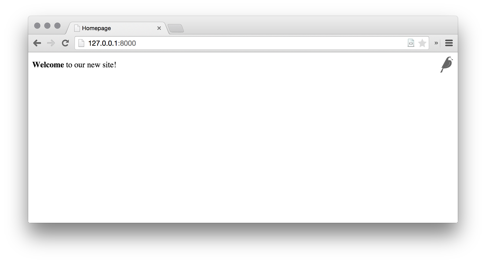
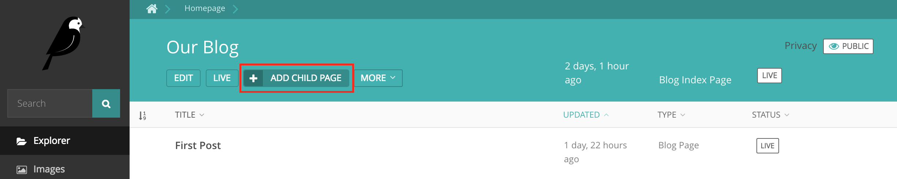
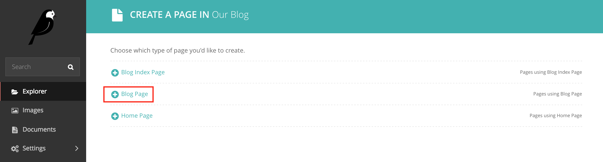

# 第一个Wagtail站点

> **注意** 此教程讲的是有关建立一个全新Wagtail项目的内容。如要将Wagtail加入到某个既有Django项目，请参考[将Wagtail集成到Django项目](integrating_into_django.md)。

1. 安装 Wagtail 与其依赖：

```sh
$ pip install wagtail
```

2. 开始你的站点：

```sh
$ wagtail start mysite
$ cd mysite
```

Wagtail提供了与`django-admin.py startproject` 类似的 `start` 命令。在项目中运行 `wagtail start mysite`将生成一个新的、有着几个特定于 Wagtail 的附加文件的 `mysite` 文件夹，这些文件包括了：

+ 所需的项目设置
+ 一个有着空白的 `HomePage` 模型的“主页”应用
+ 一些基础模板
+ 一个简单的“搜索”应用。

3. 安装项目依赖

```sh
$ pip install -r requirements.txt
```

此步骤确保刚创建的项目具有相关版本的Django

4. 创建数据库

```sh
$ ./manage.py migrate
```

在没有更新项目设置时，数据库将是项目目录中的一个 SQLite 数据库文件。

5. 创建出一个管理员用户

```sh
$ ./manage.py createsuperuser
```

6. 启动服务器

```sh
$ ./manage.py runserver
```

如没有什么错误的话，访问 [http://127.0.0.1:8000]() 就可以看到一个欢迎页面了：


可在 [http://127.0.0.1:8000/admin]() 处访问到管理区


## 对`HomePage`模块进行扩展

在此开箱即用的情况下，“主页”应用在`models.py`文件中，定义了一个空白的`HomePage`模型，以及与该空白模型一起的数据库迁移，由他们二者一起，创建出了一个主页，并将Wagtail配置为使用该主页。

按照下面这样对`home/models.py`进行编辑，将一个`body`字段加入到该模型中：

```python
from django.db import models

from wagtail.core.models import Page
from wagtail.core.fields import RichTextField
from wagtail.admin.edit_handlers import FieldPanel

class HomePage(Page):
    body = RichTextField(blank=True)

    content_panels = Page.content_panels + [
        FieldPanel('body', classname="full"),
    ]
```

`body` 被定义为 `RichTextField`，一种特殊的 Wagtail 字段。当然也可以使用任意的 [Django 核心字段](https://docs.djangoproject.com/en/stable/ref/models/fields/)。`content_panels` 定义了功能及编辑接口的布局（`content_panels` define the capatibilities and the layout of the editing interface）。请参考更多有关 [创建页面模型](topics/pages.md)。

此时运行 `./manage.py makemigrations`，接着 `./manage.py migrate` 命令，来用模型改变对数据库作出更新。在每次修改了模型定义时，都 **必须** 运行这两个命令。

现在就可以在 Wagtail 管理区（前往 “页面”、“主页”，然后点击“编辑”）对该主页进行编辑了。在`body`字段输入一些文字，并发布该页面。

现在就需要将对应的页面模板加以更新，以反映对模型作出的改变。Wagtail使用一般Django模块，来渲染各种页面类型。默认他将查找一个由应用与模型名称组成、以下划线表示大写字母分开的模板文件名（比如，“主页”应用中的`HomePage`模型，就成为了`home/home_page.html`）。该模板文件可存在于由 [Django的模板规则](https://docs.djangoproject.com/en/stable/intro/tutorial03/#write-views-that-actually-do-something) 所识别的任何位置；通常他是放在一个应用内的 `templates`文件夹下的。

> **注** 可以看出 Wagtail, 以至其基础Django，采用的是 “模型-视图” 编程模型。

将 `home/templates/home/home_page.html`编辑为包含以下内容：

```html




template-homepage


    {{ page.body|richtext }}

```




## 关于 Wagtail 模板的标签

**Wagtail template tags**

Wagtail提供了一些 [模板标签与过滤器](topics/writing_templates.md#template_tags_and_filters)，通过在模板文件顶部包含 ``，装入这些标签与过滤器。

在本教程中，将用到 `richtext` 过滤器，来将某个 `RichTextField` 字段中的内容进行转写与打印出来（to escape and print the contents of a `RichTextField`）。

```html

{{ page.body|richtext }}
```

这段代码将产生出：

```html
<div class="rich-text">
    <p>
        <b>Welcome</b> to our new site!
    </p>
</div>
```

**注意：** 对于用到Wagtail自带标签的所有模板，都需要包含 ``。如没有装入这些标签，那么Django将会抛出一个 `TemplateSyntaxError`错误。

## 一个简单的博客系统

现在已做好建立一个博客的准备了。运行`./manage.py startapp blog`命令，来在Wagtail站点中创建一个新的应用。

将此新的 `blog` 应用加入到 `mysite/settings/base.py` 文件的 `INSTALLED_APPS` 变量中。

### 博客目录与文章

**Blog Index and Posts**

这里以一个简单的博客目录页面开始。在`blog/models.py`中：

```python
from wagtail.core.models import Page
from wagtail.core.fields import RichTextField
from wagtail.admin.edit_handlers import FieldPanel

class BlogIndexPage(Page):
    intro = RichTextField(blank=True)

    content_panels = Page.content_panels + [
        FieldPanel('intro', classname="full")
    ]
```

然后运行 `./manage.py makemigrations` 与 `./manage.py migrate`命令。

因为该模型被命名为`BlogIndexPage`，因此默认的模板名称（在没有覆盖的情况下）将是`blog/template/blog/blog_index_page.html`。使用以下内容创建出该文件：

```html




template-blogindexpage


    <h1>{{ page.title }}</h1>
    <div class="intro">{{ page.intro|richtext }}</div>

    
        <h2><a href="">{{ post.title }}</a></h2>
        {{ post.specific.intro }}
        {{ post.specific.body|richtext }}
    

```

该模板中大部分都是熟悉的，但稍后要对`get_children`做一下解释。请注意`pageurl`这个标签，那与Django的`url`表情类似，不过`pageurl`带有一个Wagtail页面对象作为参数。

在Wagtail管理界面，创建一个`BlogIndexPage`，作为主页的子页面，并确保其在`效果提升（Promote）`分页中有着“blog”的一个slug。那么现在就应该可以在站点上访问到`/blog`这个URL了（请 **留意** 该`Promote`分页上的 slug `blog` 是如何定义页面URL的）。

现在需要一个博客文章的模型与模板了。在文件`blog/models.py`中：

```python
from django.db import models

from wagtail.core.models import Page
from wagtail.core.fields import RichTextField
from wagtail.admin.edit_handlers import FieldPanel
from wagtail.search import index

class BlogIndexPage(Page):
    intro = RichTextField(blank=True)

    content_panels = Page.content_panels + [
        FieldPanel('intro', classname="full")
    ]

# 保留 BlogIndexPage的定义，并加入：

class BlogPage(Page):
    date = models.DateField("发布日期")
    intro = models.CharField(max_length=250)
    body = RichTextField(blank=True)

    search_fields = Page.search_fields + [
        index.SearchField('intro'),
        index.SearchField('body'),
    ]

    content_panels = Page.content_panels + [
        FieldPanel('date'),
        FieldPanel('intro'),
        FieldPanel('body', classname="full"),
    ]
```

现在运行 `python manage.py makemigrations`与`python manage.py migrate`命令。

在 `blog/templates/blog/blog_page.html`创建一个模板：

```html




template-blogpage


    <h1>{{ page.title }}</h1>
    <p class="meta">{{ page.date }}</p>
    <div class="intro">{{ page.intro }}</div>

    {{ page.body|richtext }}

    <p><a href="{{ page.get_parent.url }}">返回博客首页</a></p>

```

请注意这里使用了Wagtail的内建`get_parent()`方法，来获取此文章所对应博客首页的URL。

现在创建一些作为`BlogIndexPage`的子页面的博客文章出来。在建立这些博客文章是一定要选择`Blog Page`类型。






Wagtail将给予你对不同父内容类型下，可建立何种内容的完全掌控的能力（Wagtail gives you full control over what kinds of content can be created under various parent content types）。默认所有页面类型，都可以是任意其他页面类型的子页面。


此时就有了一个可初步工作的博客系统了。在`/blog`URL处访问该博客，将看到如下页面：


文章标题应是链接到文章页面的，同时在每个文章页面的底部，都应有一个返回到博客主页的链接。

## 关于父页面与子页面

**Parents and Children**


